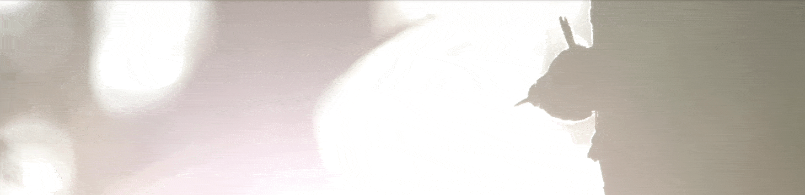

# A short introduction to acoustic analysis

You can find it [HERE](https://nilomr.github.io/bioacoustics-practical).

This guide was prepared as part of a short introductory course on avian behaviour and ecology for 2nd year Biology undergraduate students. 