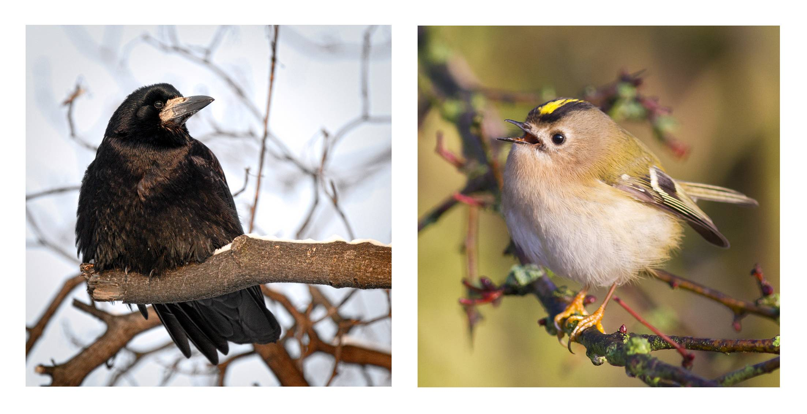

```{r setup, include=FALSE}
knitr::opts_chunk$set(echo = TRUE, eval = TRUE, cache = TRUE, results="hide")
```

> This guide has a number of direct hyperlinks: I recommend that you right-click and open them in new browser tabs.

> **Note:** I will circulate a complete version of the project folder closer to the day of the session, including code and answers. You should then rename or delete this outdated version.

# Prerequisites

> Please follow the following instructions before the day of the practical. You can contact me at [nilo.recalde\@zoo.ox.ac.uk](mailto:nilo.recalde@zoo.ox.ac.uk){.email} if you run into trouble.

## Install Sonic Visualiser

We will be using this application to view and annotate the contents of audio files. Go to [this website](https://www.sonicvisualiser.org/download.html) and download the installer for your platform (i.e., Windows, Mac, or a Linux distribution). Navigate to the downloaded file, execute it and follow any instructions. You can check that the installation has been successful by right-clicking on an audio file (e.g., .wav) and choosing 'open with', then 'Sonic Visualiser'.

There are some demo videos [here](https://www.sonicvisualiser.org/videos.html), including one on how to install this software on Mac, and [this](https://www.sonicvisualiser.org/doc/reference/4.3/en/) is the reference manual.

## Install R dependencies

Double-click to open the `bioacoustics-practical.Rproj` file in RStudio. Now open the `intro-vignette.Rmd` file from RStudio and execute the code chunk below. You can do this by clicking the green 'play' button to the right of the chunk or by pressing `ctrl/cmd+shift+enter`. This will install the code libraries required for this practical should you not have them already. Depending on the speed of your internet connection this might take up to a few minutes.

```{r dependencies, message = FALSE}

dependencies = c(
    "warbleR",
    "dplyr",
    "magrittr",
    "stringr",
    "ggrepel"
  )
# Load or install packages 
packages = lapply(dependencies, function(y) {
  if (!y %in% installed.packages()[, "Package"])  {
    install.packages(y)
  }
  try(require(y, character.only = T), silent = T)
})
```

------------------------------------------------------------------------

# General introduction

## Introducing the dataset

Navigate to `data/audio-files` in your project folder, `bioacoustics-practical`.

These audio files are sample vocalisations for 15 bird species across a wide body mass range --- from the Goldcrest's 5.8 grams of sheer adorableness to the much graver looking Rook, over 70 times larger.



During this activity you will:

-   try to guess the species that produced each of these vocalisations,
-   extract and analyse basic acoustic information to test hypotheses involving sound, and
-   learn how to perform more complex audio feature extraction and analysis to classify vocalisations

## Visualising sound

Right-click the first file and choose 'open with', then 'Sonic Visualiser'. You might want to make this software your default option to open `.wav` files; this will save you having to do this every time you want to open a new file. ([?](https://letmegooglethat.com/?q=How+to+associate+a+file+extension+with+an+application))

Once the file is open you should see a waveform at the bottom of the window.


Press `W` on your keyboard (alternatively, click on the 'Pane' menu, then 'Add Waveform'). You will see a second waveform, this time with greater temporal resolution.

-   Play the sound by pressing your spacebar.
-   Scroll to increase or decrease the time range.

This is a useful visualisation if we want to see how 'loud' vocalisations are at a particular point in time. But it does not give us any information about the spectral characteristics of the sound, that is, about how much vibration there is at each different frequency.

For this reason, researchers working with sound often use [spectrograms](https://en.wikipedia.org/wiki/Spectrogram), sometimes also called sonographs. You can take a minute to play around in [this website](https://musiclab.chromeexperiments.com/Spectrogram/) to see how a spectrogram works. Notice how the y-axis represents a range of frequencies, the x-axis shows time, and colour encodes amplitude, or how 'loud' each point is.


Now, back in Sonic Visualiser,

-   You can now remove the waveform pane (`right-click > delete layer` until there are none left) and add a new spectrogram pane by pressing `G`.
-   Change the `Window` parameter to 512 or 1024 and `Window overlap`, to its right, to 93.75%. [Here](http://www.avisoft.com/tutorials/selecting-appropriate-spectrogram-parameters/) is brief explanation of these parameters affect the resolution of the spectrogram, should you be interested. Play around with these - the different species in the dataset have been recorded at different sample rates, so the optimal parameters will change.
-   Use the zoom wheels to zoom in or out in the x and y axes.
-   Change the colour palette in the `Colour` tab if you want.
-   Use the first wheel to the right of the colour tab to play with the colour threshold; it is useful to adjust this until the background noise disappears (see gif below)
-   Once you are happy with how the spectrogram looks you can click on `File > Export Session as Template`, give it a name, and select the option to set it as default. This will spare you from having to do this every time you open a new file.


## Measuring sound

We are now going to explore a real hypothesis concerning the frequencies at which birds produce their vocalisations. In the process, you will learn to manually extract basic information from sound recordings.

**The problem:**

We know that the size of the vibrating structure that produces a sound influences its frequency, so we might expect that **A**, body size, be correlated with **B,** the morphology of the vocal apparatus, which would, in turn, influence **C**, the frequency of a bird's vocalisations. We cannot easily investigate **B** in the course of this activity, but we can test whether **A** and **C** are themselves correlated --- which would provide some support for this idea.

<br>

> Q1: If there is indeed a correlation between the size of a bird and the frequency of its vocalisations, of which sign would you expect it to be?

> Q2: What other factors might lead to differences in frequency across different bird species

<br>

To test this hypothesis --- that body size affects the frequency of vocalisations --- you will need to extract some basic spectral information from these vocalisations:

<br>

**Extracting time and frequency data from songs using Sonic Visualiser**

-   Click on `Layer > Add New Boxes Layer` in a Sonic Visualiser window (right click on the spectrogram or go to the top menu. You can now draw boxes over the elements of interest, and erase any box that you are not happy with.


-   Adjust the colour threshold (as explained above) until only the brightest parts of the image are visible. This will help you focus on the frequencies with the highest amplitude, or peak frequencies, which is the song trait that we will analyse here.


-   Draw boxes over a representative sample of the acoustic elements present in a recording. Do this for each discrete type of sound that you see, but you do not need to include more than one or two examples per type. Indeed, for swiftness' sake, you *shouldn't*. You do not need to segment more than ~ 10 elements per audio file: a small number will already capture important information.

-   Once you are done with a recording, press `ctrl+Y`/`cmd+Y`, or click on `File > Export Annotation Layer`. Give this file a name --- specifically, the number of the file + .csv, for example, `1.csv` --- and save it in the `/data/frequency-data/` folder within this project's folder. Leave the option to include a header unticked.

- You can now close the current file (no need to save the session) and open the next one.

<br>

> While you work through the vocalisations, notice how some birds have simple, pure-tone vocalisations, while those of others have a multi-frequency harmonic spectrum, with a fundamental frequency and many harmonic overtones. Still other species combine these two types skilfully.
>
> Q: Can you find examples of each of these in the dataset? What might be the mechanisms that produce these differences? [Here](https://www.pnas.org/content/100/12/7372) is a paper about this if you want to read more.

<br>

**Visualising the results using R**

Now we will import the data that you have just generated using R, get the mean frequency for each species, and plot our variables of interest --- mean frequency and body mass.

- Open the R project in Rstudio. This is the `bioacoustics-practical.Rproj` file. Once you are in Rstudio, open the `full-vignette.Rmd` and navigate to this section. If you press `Ctrl/Cmd+Shift+O` while the Rstudio window is active you will get an outline of the document, which might help you find your way more easily.

- First, the following code chunk will install the code libraries required for this practical, should you not have them already:

```{r dependencies-2, message = FALSE}

dependencies = c(
    "warbleR",
    "dplyr",
    "magrittr",
    "stringr",
    "ggrepel",
    "patchwork"
  )
# Load or install packages 
packages = lapply(dependencies, function(y) {
  if (!y %in% installed.packages()[, "Package"])  {
    install.packages(y)
  }
  try(require(y, character.only = T), silent = T)
})

```

- Now we will import the data that you manually extracted from the audio files.

```{r read-frequencies, message = FALSE}

# Import the vocalisation frequency data
body_mass_df = read.csv(file.path(getwd(), "data", "bird-ids-private.csv"), header = TRUE)

freq_data_files = list.files(file.path(getwd(), "data", "frequency-data"))

freq_list = list()
for (file in freq_data_files) {
  df = read.csv(file.path(getwd(), "data", "frequency-data", file), header = FALSE)[3:4] # get the min/max ferquency data
  global_mean = mean(rowMeans(df, na.rm = TRUE)) # Get mean for each element and then global mean
  print(c(file, global_mean))
  freq_list[gsub("\\.csv$", "", file)] = global_mean
}

freq_df = stack(freq_list) %>% # make a dataframe with the frequency and ID info
  rename(file = ind, mean_frequency = values)

```

- The next step is to read the body mass data and your species guesses.

```{r read-body-mass, message = FALSE}

body_mass_df = read.csv(file.path(getwd(), "data", "body-mass-data.csv"), header = TRUE)

ids_df = read.csv(file.path(getwd(), "data", "bird-ids.csv"), header = TRUE) %>% 
  replace(is.na(.), "Unknown") %>% 
  mutate(name = str_replace(str_to_sentence(name), "_", " "), file = as.factor(file))

# Now put everything together in a single dataframe
full_df = cbind(ids_df, body_mass_df) %>% left_join(., freq_df)
```

-  we can plot our two variables:

```{r split-variables-plot, message = FALSE, out.width="140%", fig.cap="placeholder"}

# Let's put some plot settings into a function so that we can reuse them:
bioac_theme = function() {
    theme(
    panel.background =  element_rect(fill = '#f5f5f5', colour = '#f5f5f5'),
    panel.grid.major = element_blank(),
    panel.grid.minor = element_blank(),
    axis.ticks.y = element_blank(),
    axis.ticks.x = element_blank(),
    legend.position = "none",
    text = element_text(size = 15),
    plot.title = element_text(vjust = 0.1),
    
  )
}

# Now plot each variable separately

bmass_plot = full_df %>% ggplot(aes(x=body_mass)) + 
  geom_density(fill='#bfbfbf', colour='#bfbfbf') + 
  geom_rug(length = unit(0.045, "npc")) + 
  theme(aspect.ratio = 1) +
  bioac_theme() +
  theme(plot.margin = unit(c(0,30,0,0), "pt")) +
  labs(
    x = '\nBody mass (g)',
    y = 'Density\n'
  )

freq_plot = full_df %>% ggplot(aes(x=mean_frequency)) + 
  geom_density(fill='#bfbfbf', colour='#bfbfbf') + 
  geom_rug(length = unit(0.045, "npc")) + 
  theme(aspect.ratio = 1) +
  bioac_theme()+
    labs(
    x = '\nMean frequency (Hz)',
    y = element_blank()
  )

bmass_plot + freq_plot + plot_annotation(
    title = 'Smoothed histograms (KDEs) of our two variables\n',
    caption = '\nKDE = Kernel Density Estimation, not the right method to use here but useful for vis. purposes',
    theme = theme(plot.title = element_text(size = 18, hjust = 0.5), plot.caption = element_text(size = 7, hjust = 0.5))
  ) 
```


> Q: How are these two variables distributed?

- Finally, let's take a look at how the variables are related:

```{r main-plot, message = FALSE, out.width="140%", fig.cap="placeholder"}

# Plot the data
full_df %>%
  mutate(name = str_replace(str_to_sentence(name), "_", " ")) %>%  # Remove underscore and capitalise species names
  ggplot(aes(x = body_mass, y = mean_frequency)) +
  geom_smooth(
    method = 'lm',
    colour = 'grey',
    fill = 'grey',
    alpha = 0.21
  ) +
  geom_point(size = 3) +
  scale_x_log10() +
  geom_text_repel(
    aes(label = name),
    seed = 666,
    min.segment.length = 0,
    box.padding	= 0.5,
    color = 'black',
    size = 3.3,
    force = 10,
    alpha = 0.6,
    max.time = 1,
    segment.curvature	= 0.2,
    segment.alpha	= 0.6,
    fontface = 'italic'
  ) +
  labs(
    title = 'mean frequency vs body mass\n',
    x = '\nLog body mass (g)',
    y = 'Frequency (Hz)\n'
  ) +
  theme(aspect.ratio = 0.6, plot.title = element_text(hjust = 0.5)) +
  bioac_theme()

```


vocaliza
 tions is negatively correlated with body size. The allometric relationship between the frequency
 of vocalizations and body size arises because of
 physical and energetic constraints; animals can
 not efficiently produce sound waves larger than
 the size of their body or their sound-producing
 apparat

vocal physiology can be decoupled from body size


Departures from a negative allometric relationship between frequency of acoustic signals and body size may then reflect (1) differences in evolutionary history that caused variation in syrinx or vocal tract morphology (phylogenetic constraints) and (2) differences in costs or benefits of producing low‐frequency sounds. Thus, variation in frequency may inform about current or past selection on acoustic signals [from 2020 paper]

## Get sound files

A global analysis of song frequency in passerines provides no support for the acoustic adaptation hypothesis but suggests a role for sexual selection <https://onlinelibrary.wiley.com/doi/10.1111/ele.13662>

The Role of Body Size, Phylogeny, and Ambient Noise in the Evolution of Bird Song <https://www.journals.uchicago.edu/doi/abs/10.1086/284398>

# re F0 etc

This is a problem that can be to some extent solved using more complex, automated extraction methods, but it is a very difficult issue. For now, you can add contrast to the spectrogram and select what you think might be the 'frequency'? with highest amplitude (the loudest)
