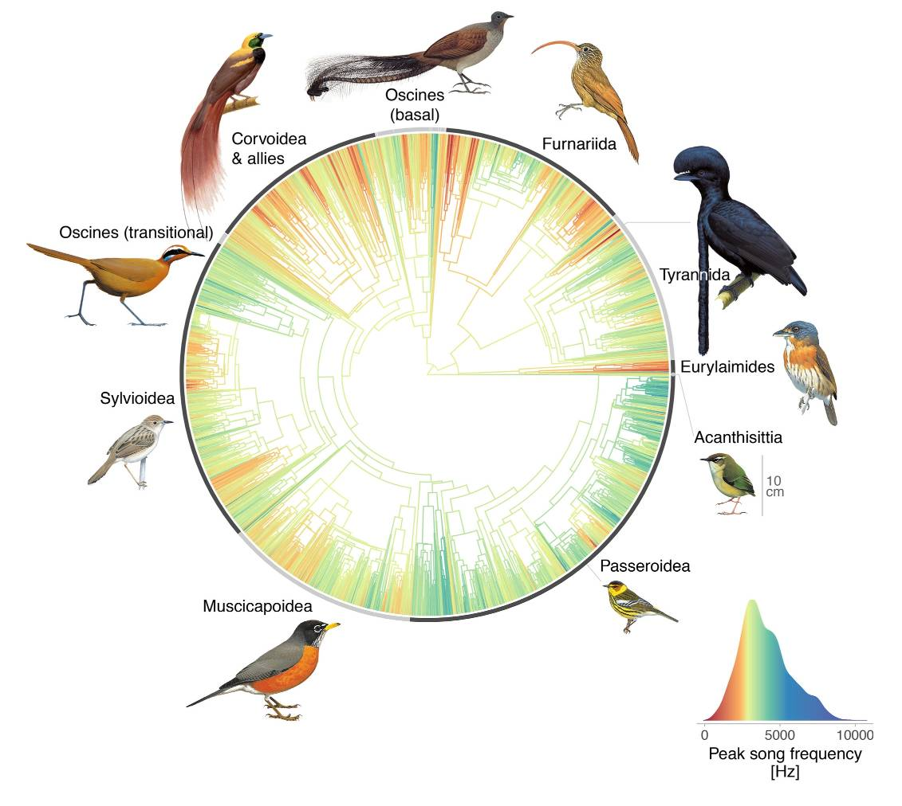

```{r setup, include=FALSE}
knitr::opts_chunk$set(echo = TRUE, eval = TRUE, cache = TRUE, results="hide")
```
***


> This guide has a number of direct hyperlinks: I recommend that you right-click and open them in new browser tabs.
> You will need ~ 3gb of free disk space for this activity. I recommend that you close any running software other than Rstudio, as well as any unused browser tabs before you start running code.


# Prerequisites

> Please follow the following instructions before the day of the practical. You can contact me at [nilo.recalde\@zoo.ox.ac.uk](mailto:nilo.recalde@zoo.ox.ac.uk){.email} if you run into trouble.

## Install Sonic Visualiser

We will be using this application to view and annotate the contents of audio files. Go to [this website](https://www.sonicvisualiser.org/download.html) and download the installer for your platform (i.e., Windows, Mac, or a Linux distribution). Navigate to the downloaded file, execute it and follow any instructions. You can check that the installation has been successful by right-clicking on an audio file (e.g., .wav) and choosing 'open with', then 'Sonic Visualiser'.

There are some demo videos [here](https://www.sonicvisualiser.org/videos.html), including one on how to install this software on Mac, and [this](https://www.sonicvisualiser.org/doc/reference/4.3/en/) is the reference manual.

## Install R dependencies

Double-click to open the `bioacoustics-practical.Rproj` file in RStudio. Now open the `intro-vignette.Rmd` file from RStudio and execute the code chunk below. You can do this by clicking the green 'play' button to the right of the chunk or by pressing `ctrl/cmd+shift+enter`. This will install the code libraries required for this practical should you not have them already. Depending on the speed of your internet connection this might take up to a few minutes.

```{r dependencies, message = FALSE}

dependencies = c(
    "warbleR",
    "dplyr",
    "magrittr",
    "stringr",
    "ggrepel"
  )
# Load or install packages 
packages = lapply(dependencies, function(y) {
  if (!y %in% installed.packages()[, "Package"])  {
    install.packages(y)
  }
  try(require(y, character.only = T), silent = T)
})
```

------------------------------------------------------------------------

# General introduction

## Introducing the dataset

Navigate to `data/audio-files` in your project folder, `bioacoustics-practical`.

These audio files are sample vocalisations for 15 bird species across a wide body mass range --- from the Goldcrest's 5.8 grams of sheer adorableness to the much graver looking Rook, over 70 times larger.


During this activity you will:

-   try to guess the species that produced each of these vocalisations,
-   extract and analyse basic acoustic information to test hypotheses involving sound, and
-   learn how to perform more complex audio feature extraction and analysis to classify vocalisations

## Visualising sound

Right-click the first file and choose 'open with', then 'Sonic Visualiser'. You might want to make this software your default option to open `.wav` files; this will save you having to do this every time you want to open a new file. ([?](https://letmegooglethat.com/?q=How+to+associate+a+file+extension+with+an+application))

Once the file is open you should see a waveform at the bottom of the window.


Press `W` on your keyboard (alternatively, click on the 'Pane' menu, then 'Add Waveform'). You will see a second waveform, this time with greater temporal resolution.

-   Play the sound by pressing your spacebar.
-   Scroll to increase or decrease the time range.

This is a useful visualisation if we want to see how 'loud' vocalisations are at a particular point in time. But it does not give us any information about the spectral characteristics of the sound, that is, about how much vibration there is at each different frequency.

For this reason, researchers working with sound often use [spectrograms](https://en.wikipedia.org/wiki/Spectrogram), sometimes also called sonographs. You can take a minute to play around in [this website](https://musiclab.chromeexperiments.com/Spectrogram/) to see how a spectrogram works. Notice how the y-axis represents a range of frequencies, the x-axis shows time, and colour encodes amplitude, or how 'loud' each point is.


Now, back in Sonic Visualiser,

-   You can now remove the waveform pane (`right-click > delete layer` until there are none left) and add a new spectrogram pane by pressing `G`.
-   Change the `Window` parameter to 512 or 1024 and `Window overlap`, to its right, to 93.75%. [Here](http://www.avisoft.com/tutorials/selecting-appropriate-spectrogram-parameters/) is brief explanation of these parameters affect the resolution of the spectrogram, should you be interested. Play around with these - the different species in the dataset have been recorded at different sample rates, so the optimal parameters will change.
-   Use the zoom wheels to zoom in or out in the x and y axes.
-   Change the colour palette in the `Colour` tab if you want.
-   Use the first wheel to the right of the colour tab to play with the colour threshold; it is useful to adjust this until the background noise disappears (see gif below)
-   Once you are happy with how the spectrogram looks you can click on `File > Export Session as Template`, give it a name, and select the option to set it as default. This will spare you from having to do this every time you open a new file.


# Identifying some widespread UK birds

Navigate to `./data/audio-files` in your project folder, `bioacoustics-practical`.

These are recordings of songs and vocalisations of 15 species of birds. These are selected as species that we should hear in and around Oxford in the next two weeks, but are just identified with file names `1.mp3` to `15.mp3`.

1. Your task is to work out the identity of the 15 species in the recordings & record these in your `bird-ids.csv` list, which can be found in the `./data` folder. Some of you may want to have a go based on your existing knowledge, but even if so, please go to [xeno-canto](https://www.xeno-canto.org/) and search for the species and listen to listed recordings of song to double check.

2. If you’re less sure, please open the `rand-species-names.csv` file which has the (randomised) species names in them. This will give you a list of species to match up with the recordings.

3. Go to [xeno-canto](https://www.xeno-canto.org/) and enter a species names in the search box at the top – in this case you can see there are 113 hits for **Great Ti**namou and 6044 for **Great Tit** – it is the latter that we want!


4. Entering “Great Tit” returns a new page with a map of the species range and the geographic location of the recording.

5. As there may be geographical variation in songs, zoom in on the UK; you’ll note that the dark blue dots on the UK correspond to the subspecies ‘*newtoni*’ on the key to the right – this is usually accepted as a subspecies endemic to the UK for great tit. Don’t worry if there is no subspecies endemic to the UK.

6. Click on the name of the UK subspecies (in this case *newtoni*) and it will filter the recordings by location to a UK list. Note that these are recordings of songs and calls, and we’re asking you to identify (mostly) songs, and that the recordings are scored on quality (in the “Actions” column from “A” – highest to “E” – lowest).


We’ve allowed c. 45 minutes for this. If any of you finish much ahead of this, please feel free to explore the functionality of xeno-canto. There are also many recordings of songs and calls on [eBird](https://ebird.org/explore): simply enter the species name that you want. 

**Please note:** 

- The xeno-canto website has had some performance problems of late - if it's acting up you can alternatively use the [Macaulay Library](https://www.macaulaylibrary.org/) and [eBird](https://ebird.org/explore).
- Make sure that you do not modify the layout of the `bird-ids.csv` file beyond entering your guesses in the 'name' column, and that you save it as a .csv when you are done.


If you have a lot of time and want quite a tough challenge, try one of the eBird audio quizzes [here](https://ebird.org/quiz/). We’ll use these species to carry out some comparative analysis of song properties in the next section.


# Measuring sound

We are now going to explore a real hypothesis concerning the frequencies at which birds produce their vocalisations. In the process, you will learn to extract basic information from sound recordings.

## The problem

We know that the size of the vibrating structure that produces a sound influences its frequency, so we might expect that **A**, body size, be correlated with **B,** the morphology of the vocal apparatus, which would, in turn, influence **C**, the frequency of a bird's vocalisations. We cannot easily investigate **B** in the course of this activity, but we can test whether **A** and **C** are themselves correlated --- which would provide some support for this idea.

<br>

> Q1: If there is indeed a correlation between the size of a bird and the frequency of its vocalisations, of which sign would you expect it to be?

> Q2: What other factors might lead to differences in frequency across different bird species?

<br>

To test this hypothesis --- that body size affects the frequency of vocalisations --- you will need to extract some basic spectral information from your dataset.

<br>

## Extracting time and frequency data from sound files


-   Click on `Layer > Add New Boxes Layer` in a Sonic Visualiser window (right click on the spectrogram or on the top menu). You can now draw boxes over the elements of interest, and erase any box that you are not happy with.


-   Adjust the colour threshold (as explained above) until only the brightest parts of the image are visible. This will help you focus on the frequencies with the highest amplitude, or peak frequencies, which is the song trait that we will analyse here.


-   Draw boxes over a representative sample of the acoustic elements present in a recording. Do this for each discrete type of sound that you see, but you do not need to include more than one or two examples per type. Indeed, for swiftness' sake, you *shouldn't*. You do not need to segment more than ~ 10 elements per audio file: a small number will already capture important information.

-   Once you are done with a recording, press `ctrl+Y`/`cmd+Y`, or click on `File > Export Annotation Layer`.

- Give this file a name --- exactly the number of the file + .csv, for example, `1.csv` --- and save it in the `/data/frequency-data/` folder within the project's folder. Leave the option to include a header unticked.

- You can now close the current file (no need to save the session) and open the next one.

<br>

> While you work through the vocalisations, notice how some birds have simple, pure-tone vocalisations, while those of others have a multi-frequency harmonic spectrum, with a fundamental frequency and many harmonic overtones. Still other species combine these two types skilfully.
>
> Q: Can you find examples of each of these in the dataset? What might be the mechanisms that produce these differences? [Here](https://www.pnas.org/content/100/12/7372) is a paper about this if you want to read more.

<br>

## Visualising the results using R

Now we will import the data that you have just generated using R, get the mean frequency for each species, and plot our variables of interest: mean frequency and body mass.

- Open the R project in Rstudio (this is the `bioacoustics-practical.Rproj` file). Once in Rstudio, open the `full-vignette.Rmd` and navigate to this section. If you press `Ctrl/Cmd+Shift+O` while the Rstudio window is active you will get an outline of the document, which might help you find your way more easily.

- First, the following code chunk will install the code libraries required for this practical, should you not have them already:

```{r dependencies-2, message = FALSE}

dependencies = c(
    "warbleR",
    "dplyr",
    "magrittr",
    "stringr",
    "ggrepel",
    "patchwork",
    "filesstrings"
  )
# Load or install packages 
packages = lapply(dependencies, function(y) {
  if (!y %in% installed.packages()[, "Package"])  {
    install.packages(y)
  }
  try(require(y, character.only = T), silent = T)
})

# Where are you?
maindir = getwd()
print(maindir) # you should be in the `bioacoustics-practical` folder
# Go back to the root folder if needed
if (basename(maindir) == 'two-species-files'){
  setwd(dirname(dirname(maindir)))
  maindir = getwd()
}
 

```

- Now we will import the data that you manually extracted from the audio files.

```{r read-frequencies, message = FALSE}

# Import the vocalisation frequency data
body_mass_df = read.csv(file.path(getwd(), "data", "bird-ids-private.csv"), header = TRUE)

freq_data_files = list.files(file.path(getwd(), "data", "frequency-data"))

freq_list = list()
for (file in freq_data_files) {
  df = read.csv(file.path(getwd(), "data", "frequency-data", file), header = FALSE)[3:4] # get the min/max ferquency data
  global_mean = mean(rowMeans(df, na.rm = TRUE)) # Get mean for each element and then global mean
  freq_list[gsub("\\.csv$", "", file)] = global_mean
}

freq_df = stack(freq_list) %>% # make a dataframe with the frequency and ID info
  rename(file = ind, mean_frequency = values)

```

- The next step is to read the body mass data and your species guesses.

```{r read-body-mass, message = FALSE}

body_mass_df = read.csv(file.path(getwd(), "data", "body-mass-data.csv"), header = TRUE)

ids_df = read.csv(file.path(getwd(), "data", "bird-ids.csv"), header = TRUE) %>% 
  replace(is.na(.), "Unknown") %>% 
  mutate(name = str_replace(str_to_sentence(name), "_", " "), file = as.factor(file))

# Now put everything together in a single dataframe
full_df = cbind(ids_df, body_mass_df) %>% left_join(., freq_df) %>% 
  mutate(across(where(is.numeric), ~ round(., 2)))
```

- You can take a look at the final dataset:

```{r table, include=T, results='asis'}
knitr::kable(full_df, digits=2)
```

- Let's now inspect the variables separately:

```{r split-variables-plot, message = FALSE, out.width="140%"}

# Put some plot settings into a function so that we can reuse them:
bioac_theme = function() {
    theme(
    panel.background =  element_rect(fill = '#f5f5f5', colour = '#f5f5f5'),
    panel.grid.major = element_blank(),
    panel.grid.minor = element_blank(),
    axis.ticks.y = element_blank(),
    axis.ticks.x = element_blank(),
    legend.position = "none",
    text = element_text(size = 15),
    plot.title = element_text(vjust = 0.1),
    
  )
}

# Plot each variable separately

bmass_plot = full_df %>% ggplot(aes(x=body_mass)) + 
  geom_density(fill='#bfbfbf', colour='#bfbfbf') + 
  geom_rug(length = unit(0.045, "npc")) + 
  theme(aspect.ratio = 1) +
  bioac_theme() +
  theme(plot.margin = unit(c(0,30,0,0), "pt")) +
  labs(
    x = '\nBody mass (g)',
    y = 'Density\n'
  )

freq_plot = full_df %>% ggplot(aes(x=mean_frequency)) + 
  geom_density(fill='#bfbfbf', colour='#bfbfbf') + 
  geom_rug(length = unit(0.045, "npc")) + 
  theme(aspect.ratio = 1) +
  bioac_theme()+
    labs(
    x = '\nMean frequency (Hz)',
    y = element_blank()
  )

bmass_plot + freq_plot + plot_annotation(
    title = 'Smoothed histograms (KDEs) of our two variables\n',
    caption = '\nKDE = Kernel Density Estimation, not the right method to use here but useful for vis. purposes',
    theme = theme(plot.title = element_text(size = 18, hjust = 0.5), plot.caption = element_text(size = 7, hjust = 0.5))
  ) 
```

## Results

- Finally, take a look at how the variables are related:

```{r main-plot, message = FALSE, out.width="140%"}

# Plot the data
full_df %>%
  mutate(name = str_replace(str_to_sentence(name), "_", " ")) %>%  # Remove underscore and capitalise species names
  ggplot(aes(x = body_mass, y = mean_frequency)) +
  geom_smooth(
    method = 'lm',
    colour = 'grey',
    fill = 'grey',
    alpha = 0.21
  ) +
  geom_point(size = 3) +
  scale_x_log10() +
  geom_text_repel(
    aes(label = name),
    seed = 666,
    min.segment.length = 0,
    box.padding	= 0.5,
    color = 'black',
    size = 3.3,
    force = 10,
    alpha = 0.6,
    max.time = 1,
    segment.curvature	= 0.2,
    segment.alpha	= 0.6,
    fontface = 'italic'
  ) +
  labs(
    title = 'Mean frequency vs body mass\n',
    x = '\nLog body mass (g)',
    y = 'Frequency (Hz)\n'
  ) +
  theme(aspect.ratio = 0.6, plot.title = element_text(hjust = 0.5)) +
  bioac_theme()

```

Discuss!



**Further reading:**

Mikula, P., Valcu, M., Brumm, H., Bulla, M., Forstmeier, W., Petrusková, T., Kempenaers, B. and Albrecht, T. (2021), A global analysis of song frequency in passerines provides no support for the acoustic adaptation hypothesis but suggests a role for sexual selection. Ecology Letters, 24: 477-486. https://doi.org/10.1111/ele.13662

Ryan, M. J., & Brenowitz, E. A. (1985). The Role of Body Size, Phylogeny, and Ambient Noise in the Evolution of Bird Song. The American Naturalist, 126(1), 87–100. https://doi.org/10.1086/284398


# Automated bird song analysis

> With thanks to [Marcelo Araya Salas](https://marceloarayasalas.weebly.com/) (author of the warbleR package)

<br>

While taking manual measurements is a perfectly valid option when dealing with small datasets and simple variables, most problems in ecology and animal behaviour call for more complex descriptions of sound, and involve datasets that are too large to be processed manually. Automated analyses are very useful but can be hard to implement, and are not free from many of the biases that plague manual characterisation of sound. For the third part of today's session we will be exploring a simple case: a comparative analysis of the songs of two related species that are very common in the UK.

Both Great tits and Coal tits have relatively simple songs, most frequently made up of two alternating notes, that are often described to as a ‘tea-cher, tea-cher’ sound. Although Coal tits are smaller than Great tits their songs have largely overlapping frequency ranges, and they can be confused by the untrained ear.


Let's get to work!

First we need some data: we are going to get a sample of Coal and Great tit recordings from xeno-canto.
You can read the comments in the code blocks to know what we are doing at each step - don't worry if you don't understand what every bit of code is doing!

```{r ingest, message = FALSE}

# Path to the directory for this analysis
files_dir = file.path(maindir, "data", "two-species-files")

# let's make use of a few more of your computer's cores to speed things up a bit:
ncores = parallel::detectCores() - 2

# Set this to your working directory
# NOTE : changing working directories like this is a bad programming 
# practice, but necessary here due to a bug in the package that we are going to use
setwd(files_dir)

# I have pre-selected some songs for you - import a vector of their codes and download them
xc_codes = as.vector(unlist(read.csv(file.path(files_dir, "xc-codes.csv"), header = FALSE)[1])) 
lapply(xc_codes, function(code)
  xcquery = query_xc(
    qword = stringr::str_interp('nr:"${code}"'),
    download = TRUE,
    parallel = ncores
  ))

# Now we have to convert the .mp3 files to .wav, another commonly used audio file format.
# + check that the newly created wav files can be read
# + create a list with all the files that we are going to analyse

try(mp32wav()); checkwavs()
wavs <- list.files(pattern="wav$") 

# Downsample the songs to gain some speed
lapply(wavs, function(x)
  writeWave(downsample(readWave(x), samp.rate = 22050),
            filename = x))

```

Now you can go to `./data/two-species-files`, the directory for this part of the session, and inspect some of the files in Sonic Visualiser. I find that the songs of these two birds look more different than they sound - what do you think?

The basic unit in these songs is a note, which we can define as a sound represented by a continuous trace on the spectrogram, often separated by pauses. We can take advantage of this to try to detect each individual note in our dataset automatically. I have chosen particularly clean audio recordings (i.e. the signal-to-noise ratio is high) and set the parameters of the algorithm for you, so your segmentation should be fairly accurate. In reality, automatic segmentation of sound is a *really* hard problem!

```{r segment, message = FALSE}

# We are now going to run a simple algorithm that segments sounds based on their amplitude.
# It will not work perfectly, but is good enough four our purposes here
element_list = auto_detec(
  path = files_dir, 
  bp = c(2, 9),
  threshold = 4,
  mindur = 0.04,
  maxdur = 0.4,
  ssmooth = 200,
  wl = 512,
  parallel = ncores
)

# Let's export the segmented spectrograms and take a look at them:
full_spectrograms(element_list, parallel = ncores, suffix = 'seg', path = files_dir)

# Move the element spectrograms to a new folder
seg_dir = "segmentation-spectrograms"
if (!(file.exists(seg_dir))) {
  dir.create("segmentation-spectrograms")
}
lapply(list.files(pattern = "*-seg-p*"), function(file)
  file.move(file, seg_dir, overwrite = TRUE))

# If you are happy with that, save the selections to a .csv
write.csv(element_list, "song-segmentation.csv", row.names = FALSE)

```

If you go to the `segmentation-spectrograms` folder you can check whether the segmentation algorithm did a good job. You now have start and end time information for `r nrow(element_list)` notes!


Now that we have individual notes we can automatically extract some numeric descriptions of their sound. More specifically, we are going to measure 22 spectral parameters [ETC]

```{r spectral-params, message = FALSE}

# Extract some spectral parameters
spectral_parameters <- specan(element_list, path = files_dir, parallel=ncores, threshold = 15, bp = c(2,9)) %>%
  mutate(label = str_split(sound.files, "-", simplify = TRUE)[ , 2])
```

Now PCA

```{r pca, message = FALSE}

# PCA of spectral parameters
pca <- prcomp(x = spectral_parameters[, sapply(spectral_parameters, is.numeric)], scale. = TRUE)
pcascor <- as.data.frame(pca[[5]]) %>% tibble::add_column(label = spectral_parameters$label)
pcascor %>% ggplot(aes(x=PC1, y=PC2, colour=label)) +
  geom_point(alpha=0.8, shape=16) +
  scale_colour_manual(values = c('#585955', '#f0b618'), labels = c('Coal tit', 'Great tit')) +
  bioac_theme() +
  theme(legend.position = "right", aspect.ratio = 0.6, ) +
  labs(
      title = 'Principal component analysis',
      subtitle= 'based on spectral measurements\n'
    ) 

```

Some separation but lots of overlap - discuss why, shortcomings, level of description

What makes their songs distinct?

```{r modulation, message = FALSE}
# Plot measures of modulation

linecolour = adjustcolor("#c4692d", alpha.f = .9)
dfrange_plot = spectral_parameters %>% ggplot(aes(x = label, y = dfrange)) +
  geom_jitter(width = 0.2,
              alpha = 0.2,
              shape = 16) +
  stat_summary(
    fun = median,
    geom = "crossbar",
    width = 0.43,
    size = 1,
    colour = linecolour
  ) +
  bioac_theme() +
  labs(x = NULL, y = 'Dominant frequency range (kHz)\n') +
  scale_x_discrete(labels = c('Coal tit', 'Great tit')) +
  theme(aspect.ratio = 1.3, plot.margin = unit(c(0, 30, 0, 0), "pt"))

kurt_plot = spectral_parameters %>% ggplot(aes(x = label, y = kurt)) +
  geom_jitter(width = 0.2,
              alpha = 0.2,
              shape = 16) +
  stat_summary(
    fun = median,
    geom = "crossbar",
    width = 0.43,
    size = 1,
    colour = linecolour
  ) +
  bioac_theme() +
  labs(x = NULL, y = 'Kurtosis\n') +
  scale_x_discrete(labels = c('Coal tit', 'Great tit')) +
  theme(aspect.ratio = 1.3)

dfrange_plot + kurt_plot + plot_annotation(
  title = 'Measures of frequency modulation\n',
  caption = '\nHigher kurtosis = more leptokurtic, that is, having a distribution more centered around the mean than a normal distribution',
  theme = theme(
    plot.title = element_text(size = 18, hjust = 0.5),
    plot.caption = element_text(size = 9, hjust = 0.5)
  )
)
```

Temporal characteristics:
```{r pace, message = FALSE}

# Temporal characteristics
element_list = element_list %>% mutate(label = spectral_parameters$label, duration = end -
                          start, silence = c(element_list$start[2:nrow(element_list)], NA) -end ) 

silences_plot = element_list %>% 
  filter(silence >0 & silence <0.2) %>% 
  ggplot(aes(x = label, y = silence)) + 
  geom_jitter(width = 0.2,
            alpha = 0.2,
            shape = 16) +
  stat_summary(
    fun = median,
    geom = "crossbar",
    width = 0.43,
    size = 1,
    colour = linecolour
  ) +
  bioac_theme() +
  labs(x = NULL, y = 'Silence duration (s)\n') +
  scale_x_discrete(labels = c('Coal tit', 'Great tit')) +
  theme(aspect.ratio = 1.3, plot.margin = unit(c(0, 30, 0, 0), "pt"))

durations_plot = element_list %>%
  ggplot(aes(x = label, y = duration)) + 
  geom_jitter(width = 0.2,
            alpha = 0.2,
            shape = 16) +
  stat_summary(
    fun = median,
    geom = "crossbar",
    width = 0.43,
    size = 1,
    colour = linecolour
  ) +
  bioac_theme() +
  labs(x = NULL, y = 'Note duration (s)\n') +
  scale_x_discrete(labels = c('Coal tit', 'Great tit')) +
  theme(aspect.ratio = 1.3)


silences_plot + durations_plot + plot_annotation(
  title = 'A quick look at silence and note duration\n',
  theme = theme(
    plot.title = element_text(size = 18, hjust = 0.5),
    plot.caption = element_text(size = 9, hjust = 0.5)
  )
)

# setwd(maindir)
```


Extra code to go further - uncomment to use

```{rn extra, message=FALSE}

# #Extract the dominant frequency of each element, or note
# dominant_frequencies <-
#   freq_ts(
#     path = files_dir,
#     element_list,
#     wl = 512,
#     length.out = 20,
#     threshold = 15,
#     img = TRUE,
#     parallel = ncores,
#     img.suffix = "dom_freq",
#     ovlp = 95,
#     clip.edges = FALSE,
#     leglab = "ffts",
#     fsmooth = 0.2
#   )
# # Move the element spectrograms to a new folder
# dom_freq_dir = "dominant-freq-spectrograms"
# if (!(file.exists(dom_freq_dir))) {
#   dir.create("segmentation-spectrograms")
# }
# lapply(list.files(pattern = "dom_freq$"), function(file)
#   file.move(file, dom_freq_dir, overwrite = TRUE))
# # You can now go to this folder using a file explorer and take a look at some of them


```

***
