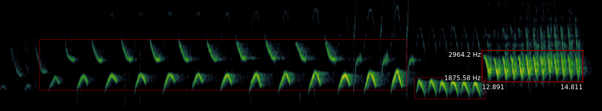

```{r setup, include=FALSE}
knitr::opts_chunk$set(echo = TRUE, eval = TRUE, cache = TRUE, results="hide")
```

> This guide has a number of direct hyperlinks: I recommend that you right-click and open them in new browser tabs.

> **Note:** I will circulate a complete version of the project folder closer to the day of the session, including code and answers. You should then rename or delete this outdated version.

# Prerequisites

> Please follow the following instructions before the day of the practical. You can contact me at [nilo.recalde\@zoo.ox.ac.uk](mailto:nilo.recalde@zoo.ox.ac.uk){.email} if you run into trouble.

## Install Sonic Visualiser

We will be using this application to view and annotate the contents of audio files.
Go to [this website](https://www.sonicvisualiser.org/download.html) and download the installer for your platform (i.e., Windows, Mac, or a Linux distribution). Navigate to the downloaded file, execute it and follow any instructions. You can check that the installation has been successful by right-clicking on an audio file (e.g., .wav) and choosing 'open with', then 'Sonic Visualiser'.

There are some demo videos [here](https://www.sonicvisualiser.org/videos.html), including one on how to install this software on Mac, and [this](https://www.sonicvisualiser.org/doc/reference/4.3/en/) is the reference manual.

## Install R dependencies

Double-click to open the `bioacoustics-practical.Rproj` file in RStudio. Now open the `intro-vignette.Rmd` file from RStudio and execute the code chunk below. You can do this by clicking the green 'play' button to the right of the chunk or by pressing `ctrl/cmd+shift+enter`. This will install the code libraries required for this practical should you not have them already. Depending on the speed of your internet connection this might take up to a few minutes.

```{r dependencies, message = FALSE}

dependencies = c(
    "warbleR",
    "dplyr",
    "magrittr",
    "stringr",
    "ggrepel"
  )
# Load or install packages 
packages = lapply(dependencies, function(y) {
  if (!y %in% installed.packages()[, "Package"])  {
    install.packages(y)
  }
  try(require(y, character.only = T), silent = T)
})
```

------------------------------------------------------------------------

# General introduction

## Introducing the dataset

Navigate to `data/audio-files` in your project folder, `bioacoustics-practical`.

These audio files are sample vocalisations for 15 bird species across a wide body mass range --- from the Goldcrest's 5.8 grams of sheer adorableness to the much graver looking Rook, over 70 times larger.


During this activity you will:

- try to guess the species that produced each of these vocalisations,
- extract and analyse basic acoustic information to test hypotheses involving sound, and 
- learn how to perform more complex audio feature extraction and analysis to classify vocalisations


## Visualising sound

Right-click the first file and choose 'open with', then 'Sonic Visualiser'. You might want to make this software your default option to open `.wav` files; this will save you having to do this every time you want to open a new file. ([?](https://letmegooglethat.com/?q=How+to+associate+a+file+extension+with+an+application))

Once the file is open you should see a waveform at the bottom of the window.


Press `W` on your keyboard (alternatively, click on the 'Pane' menu, then 'Add Waveform'). You will see a second waveform, this time with greater temporal resolution.

-   Play the sound by pressing your spacebar.
-   Scroll to increase or decrease the time range.

This is a useful visualisation if we want to see how 'loud' vocalisations are at a particular point in time. But it does not give us any information about the spectral characteristics of the sound, that is, about how much vibration there is at each diffrent frequency.

For this reason, researchers working with sound often use [spectrograms](https://en.wikipedia.org/wiki/Spectrogram), sometimes also called sonographs. You can take a minute to play around in [this website](https://musiclab.chromeexperiments.com/Spectrogram/) to see how a spectrogram works. Notice how the y-axis represents a range of frequencies, the x-axis shows time, and colour encodes amplitude, or how 'loud' each point is.


Now, back in Sonic Visualiser,

-   You can now remove the waveform pane (`right-click > delete layer` until there are none left) and add a new spectrogram pane by pressing `G`.
-   Change the `Window` parameter to 512 or 1024 and `Window overlap`, to its right, to 93.75%. [Here](http://www.avisoft.com/tutorials/selecting-appropriate-spectrogram-parameters/) is brief explanation of these parameters affect the resolution of the spectrogram, should you be interested. Play around with these - the different species in the dataset have been recorded at different sample rates, so the optimal parameters will change.
-   Use the zoom wheels to zoom in or out in the x and y axes.
-   Change the colour palette in the `Colour` tab if you want.
-   Use the first wheel to the right of the colour tab to play with the colour threshold; it is useful to adjust this until the background noise disappears.
-   Once you are happy with how the spectrogram looks you can click on `File > Export Session as Template`, give it a name, and select the option to set it as default. This will spare you from having to do this every time you open a new file.

## Measuring sound

**The problem:**

[Redacted]

**Extracting time and frequency data from songs using Sonic Visualiser**

- Click on `Layer > Add New Boxes Layer` in a Sonic Visualiser window (right-click on the spectrogram or go to the top menu. You can now draw boxes over the elements of interest, and erase any box that you are not happy with.



- Adjust the colour threshold (as explained above) until only the brightest parts of the image are visible. This will help you focus on the frequencies with the highest amplitude, or peak frequencies, which is the song trait that we will be analysing.


During the session you will segment a representative sample of the acoustic elements present in each recording. This will allow you to carry out further analyses. For now, you can just familiarise yourself with the application.

