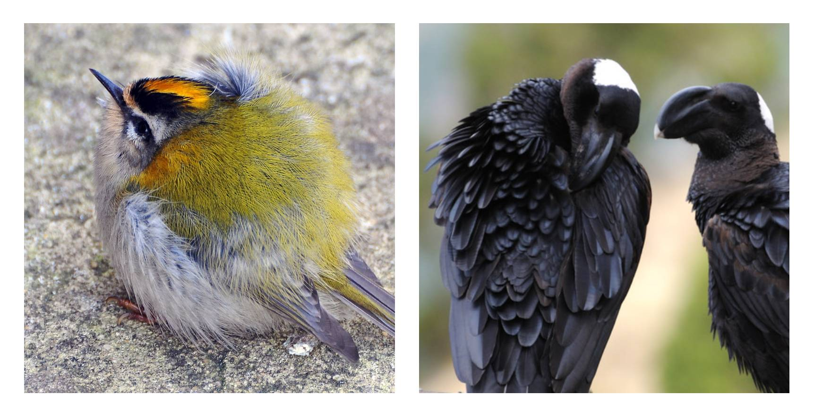
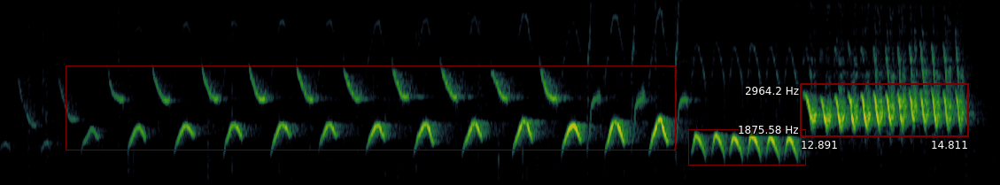
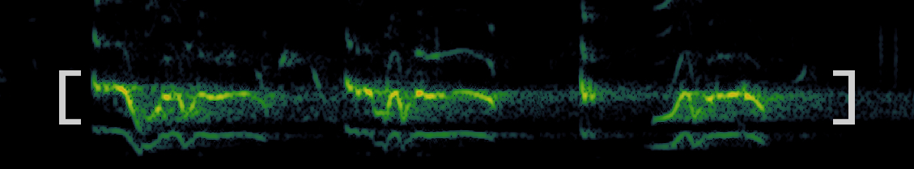
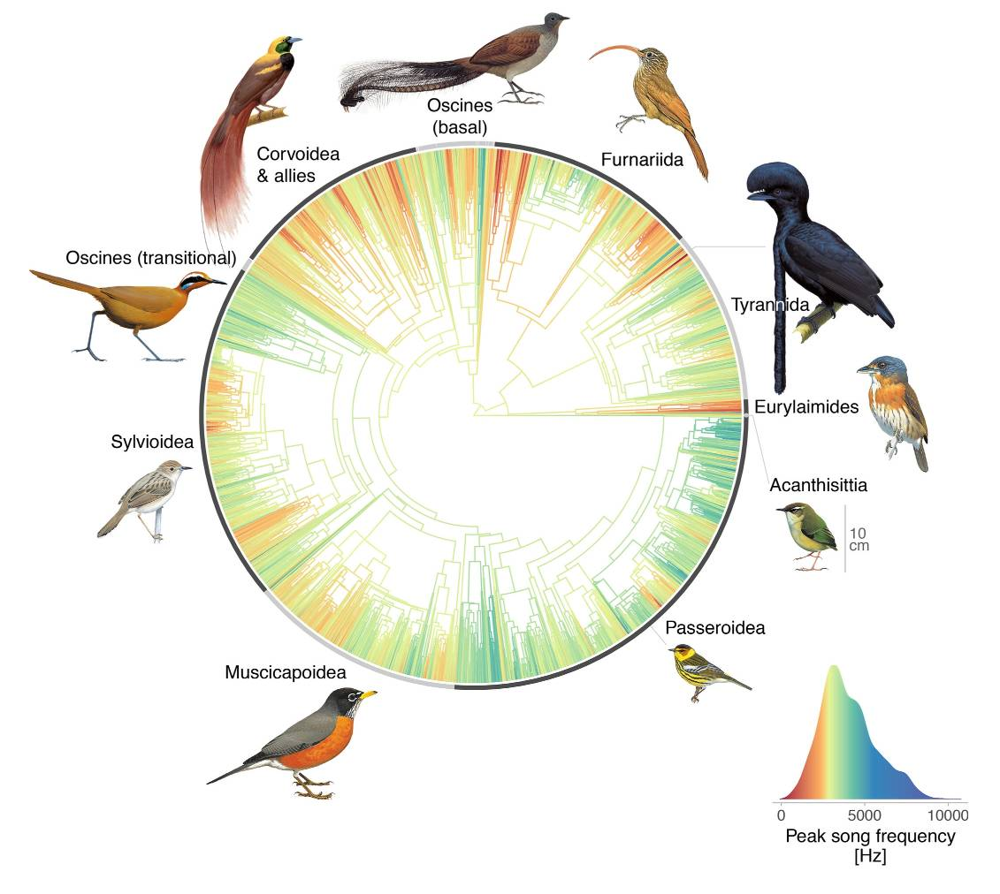

```{r setup, include=FALSE}
knitr::opts_chunk$set(echo = TRUE, eval = TRUE, cache = TRUE, results="hide")
```

> This guide has a number of hyperlinks: I recommend that you right-click and open them in new browser tabs.

# Prerequisites

> Please follow the instructions below before the day of the practical. You can contact me at [nilo.recalde\@zoo.ox.ac](mailto:nilo.recalde@zoo.ox.ac){.email} if you run into trouble.

## Install Sonic Visualiser

Go to [this website](https://www.sonicvisualiser.org/download.html) and download the installer for your platform (i.e., Windows, Mac, or a Linux distribution). Navigate to the downloaded file, execute it and follow any instructions. You can check that the installation has been successful by right-clicking on an audio file (e.g., .wav) and choosing 'open with', then 'Sonic Visualiser'.

There are some demo videos [here](https://www.sonicvisualiser.org/videos.html), including one on how to install this software on Mac, and [this](https://www.sonicvisualiser.org/doc/reference/4.3/en/) is the reference manual

## Install R dependencies

Open the `vignette.Rmd` file in RStudio and execute the first code chunk: [Setup]. You can do this by clicking the green 'play' button on the right of the chunk or by pressing `ctrl/cmd+shift+enter` or equivalent. This will install the code libraries required for this practical should you not have them already.

------------------------------------------------------------------------

# Visualising and measuring bird vocalisations

## Introducing the dataset

Navigate to `data/audio-files` in your project folder, `bioacoustics-practical`.

These audio files are sample vocalisations for 14 passerine species across a wide body mass range --- from the Common firecrest's 6.4 grams of sheer adorableness to the largest of the passerines, the Thick-billed raven, at up to 1500 grams.



## How to visualise sound

Right-click the first file and choose 'open with', then 'Sonic Visualiser'. You might want to make this software your default option to open .wav files; this will save you having to do this every time you want to open a new file. [Instructions](https://letmegooglethat.com/?q=How+to+associate+a+file+extension+with+an+application)

Once the file is open you should see a waveform in the bottom of the window.


Press `W` in your keyboard (alternatively, click on the 'Pane' menu, then 'Add Waveform'). You will see a second waveform, this time with greater temporal resolution.

-   Play the sound by pressing your spacebar.
-   Scroll to increase or decrease the time range.

This is a useful visualisation if we want to see how 'loud' vocalisations are at a particular point in time. But it does not give us any information about the spectral characteristics of the sound, that is, about how much vibration there is at each individual frequency.

For this reason, researchers working with sound often use [spectrograms](https://en.wikipedia.org/wiki/Spectrogram), sometimes also called sonographs. You can take a minute to play around in [this website](https://musiclab.chromeexperiments.com/Spectrogram/) to see how an spectrogram works. Notice how the y-axis represents a range of frequencies, the x-axis shows time, and colour encodes amplitude, or how 'loud' each point is.

Now, back in Sonic Visualiser:

-   You can now remove the waveform pane (`right click > delete layer` until there are none left) and add a new spectrogram pane by pressing `G`.
-   Change the `Window` parameter to 512 and `Window overlap`, to its right, to 93.75%. [Here](http://www.avisoft.com/tutorials/selecting-appropriate-spectrogram-parameters/) is brief explanation of these parameters affect the resolution of the spectrogram, should you be interested. Play around with these - the different species in the dataset have been recorded at different sample rates, so the optimal parameters will change.
-   Use the zoom wheels to zoom in or out in the x and y axes.
-   Change the colour palette in the `Colour` tab if you want.
-   Use the first wheel to the right of the colour tab to play with the colour threshold; it is useful to adjust this until the background noise disappears.
-   Once you are happy with how the spectrogram looks you can click on `File > Export Session as Template`, give it a name, and select the option to set it as default. This will spare you from having to do this every time you open a new file.

## Extracting basic time and frequency information

**The problem:**

We know that the size of the vibrating structure that produces a sound influences its frequency, so we might expect that (A) body size be correlated with (B) the morphology of the vocal apparatus, which might, in turn, influence (C) the frequency of a bird's vocalisations. We cannot easily investigate (B) in the course of this activity, but we can test whether (A) and (C) are themselves correlated --- which would provide some support for this idea.

> Q: If there is indeed a correlation between the size of a bird and the frequency of its vocalisations, of which sign do you expect it might be?

To test this hypothesis, we will need to extract some basic spectral information from these vocalisations:

**Extracting time and frequency data from songs using Sonic Visualiser**

- Click on `Layer > Add New Boxes Layer` in a Sonic Visualiser window (right click on the spectrogram or go to the top menu. You can now draw boxes over the elements of interest, and erase any box that you are not happy with.



- Adjust the colour threshold (as explained above) until only the brightest parts of the image are visible. This will help you focus on the frequencies with the highest amplitude, or peak frequencies, which is the song trait that we will analyse here.



- Draw boxes over a representative sample of the acoustic elements present in a recording. Do this for each type of sound that you see, but you do not need to include more than one or two examples per type. Indeed, for swiftness' sake, you *shouldn't*.

- Once you are done with a recording, press `ctrl+Y`/`cmd+Y`, or click on `File > Export Annotation Layer`. Give this file a name (I strongly suggest using the scientific name in lower case, separated by a underscore: *genus_species*) and save it in the `data/frequency-data` folder within this project's folder.

> While you work through the vocalisations, notice how some birds have simple, pure-tone vocalisations, while those of others have a multi-frequency harmonic spectrum, with a fundamental frequency and many harmonic overtones. Still others combine these two types skilfully. Can you find examples of each of these in the dataset? What might be the mechanisms that produce these differences? [Here](https://www.pnas.org/content/100/12/7372) is a paper about this if you want to read more.


# Bioacoustic analysis in R

## Setup

The following code chunk will install the code libraries required for this practical should you not have them already:

```{r dependencies, message = FALSE}

dependencies = c(
    "warbleR",
    "dplyr",
    "magrittr",
    "stringr",
    "ggrepel"
  )
# Load or install packages 
packages = lapply(dependencies, function(y) {
  if (!y %in% installed.packages()[, "Package"])  {
    install.packages(y)
  }
  try(require(y, character.only = T), silent = T)
})

```

## Read in body mass data

```{r read-body-mass, message = FALSE}
# Import the vocalisation frequency data
body_mass_df = read.csv(file.path(getwd(), "data", "body-mass-data.csv"), header = TRUE)
```

## Plot frequency vs body mass

```{r plot-body-mass, message = FALSE, out.width="120%", fig.cap="placeholder"}

# Plot the data
body_mass_df %>%
  mutate(name = str_replace(str_to_sentence(name), "_", " ")) %>%  # Remove underscore and capitalise species names
  ggplot(aes(x = body_mass, y = peak_frequency)) +
  geom_smooth(
    method = 'lm',
    colour = 'grey',
    fill = 'grey',
    alpha = 0.1
  ) +
  geom_point(size = 3) +
  scale_x_log10() +
  geom_text_repel(
    aes(label = name),
    seed = 111,
    min.segment.length = 0,
    box.padding	= 0.5,
    color = 'black',
    size = 3,
    force = 10,
    alpha = 0.7,
    max.time = 1,
    segment.curvature	= 0.2,
    segment.alpha	= 0.7,
    fontface = 'italic'
  ) +
  labs(
    title = 'Frequency vs body mass',
    subtitle = 'In a selection of passerines\n',
    x = '\nLog body mass (grams)',
    y = 'Frequency (Hz)\n'
  ) +
  theme(aspect.ratio = 1) +
  theme(
    panel.background = element_blank(),
    panel.grid.major = element_blank(),
    panel.grid.minor = element_blank(),
    axis.ticks.y = element_blank(),
    axis.ticks.x = element_blank(),
    legend.position = "none",
    text = element_text(size = 15),
    plot.title = element_text(vjust = 0.1),
    
  )

```



## Get sound files

A global analysis of song frequency in passerines provides no support for the acoustic adaptation hypothesis but suggests a role for sexual selection <https://onlinelibrary.wiley.com/doi/10.1111/ele.13662>

The Role of Body Size, Phylogeny, and Ambient Noise in the Evolution of Bird Song <https://www.journals.uchicago.edu/doi/abs/10.1086/284398>

# re F0 etc

This is a problem that can be to some extent solved using more complex, automated extraction methods, but it is a very difficult issue. For now, you can add contrast to the spectrogram and select what you think might be the 'frequency'? with highest amplitude (the loudest)
